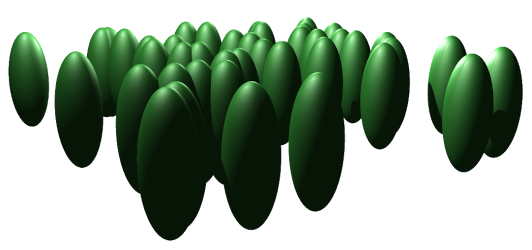
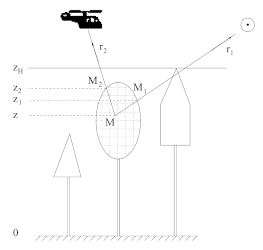

# AIROBEST project
*Artificial Intelligence for Retrieval of Forest Biomass & Structure*, funded by the [Academy of Finland](https://www.aka.fi/) program program Novel Applications of Artificial Intelligence in Physical Sciences and Engineering Research (AIPSE) (2018-2021). Principal investigators

* [Matti Mõttus, VTT Technical Research Centre of Finland](https://sensillence.github.io/VTT/)
* [Jorma Laaksonen](https://people.aalto.fi/jorma.laaksonen), Aalto University

Timely and accurate information on forest above-ground biomass (AGB) is required for understanding carbon balance, future climate, the sustainability of current politics and the emerging bioeconomy. Optical Earth Observation (EO) in the visible to short infrared spectral region can contribute to this challenge. However, despite optimistic case studies, no global applications using optical EO for biomass retrieval have emerged. The volume of EO data is increasing exponentially and new instruments will measure with better spatial and spectral resolutions, calling for new processing algorithms.

Artificial intelligence (AI) can overcome many of the shortcomings in existing empirical methods for retrieving forest characteristics such as its structure and biomass from EO data. Up to now, AI has been applied to simple canopies with little structure and no woody biomass. Recent developments in deep learning have made it feasible to utilize it for analyzing complex structured vegetation with significant AGB storage such as the boreal forest. We hypothesize that with a carefully selected approach, AI can retrieve the forest AGB which is indirectly, but physically, related to the structural parameters affecting forest reflectance, e.g., crown volume and shape, or tree density.

We propose to use a well-validated physically-based forest reflectance model to simulate the spectral reflectance factors of all possible European boreal forest canopies under different illumination conditions. We will use the simulated spectra and the corresponding AGB values to train AI algorithms such as Bayesian Convolutional Neural Network with Bernoulli Approximate Variational Inference. Once trained, we will apply these AI algorithms to optical EO data from Sweden, Finland, Estonia and Russia, and hyperspectral data from Finland. The AI retrieval results will be compared against forestry data from test sites in each of these regions.

  

AIROBEST applies AI to facilitate the use of satellite data in global change studies as well as deepen the apprehension of AI methods in industry and society. The scientific goals of the project are to determine 1) the potential of modern AI algorithms in retrieving forest AGB from EO data; 2) the most suitable AI algorithm for performing such a retrieval; and 3) the required EO data characteristics (e.g. spectral and spatial resolutions) for a successful physically-based AI retrieval of forest structure and biomass.

## Tools

  
  
    Geometric representation of forest as a collection of tree crowns; first-order scattering is numerically integrated over the crown volumes (from FRT manual by Kuusk and Nilson, 2002). 

The project uses the Forest Reflectance and Transmittance model by [Kuusk and Nilson (2000)](https://www.sciencedirect.com/science/article/abs/pii/S003442579900111X) from Tartu Observatory, parameterized with forest optical properties measured in Finland ([Hovi et al., 2017](https://www.silvafennica.fi/article/7753)). The model, written in Fortran77, has been well tested (e.g., in the [RAMI initiative](https://rami-benchmark.jrc.ec.europa.eu/)) and proven to describe adequately the boreal and hemiboreal forests analyzed in the study. During the project, the code will be modified to be callable as a python library and published online.

## Outcomes
### Code

The code repository for AIROBEST is at [GitHub](https://github.com/aalto-cbir/AIROBEST)

### Datasets
Mõttus, M., Markiet, V., Hernandez-Clemente, R., Perheentupa, V., & Majasalmi, T. (2021). SPYSTUF hyperspectral data. Dataset, https://ieee-dataport.org/open-access/spystuf-hyperspectral-data, doi:[10.21227/v5vh-2816](https://dx.doi.org/10.21227/v5vh-2816)  License: CC BY 4.0

Mõttus, M., Cu, H., Halme, E., Laaksonen, J.,  Molinier, M., & Pham, P. (2021). The Artificial Intelligence dataset for forest Geographical Applications (TAIGA). Dataset, doi:[10.23729/fe7ce882-8125-44e7-b0cf-ae652d7ed0d5](https://dx.doi.org/10.23729/fe7ce882-8125-44e7-b0cf-ae652d7ed0d5). License: CC BY 4.0 

### Publications
Halme, E., Ihalainen, O., Korpela, I. & Mõttus, M. (2022) Assessing spatial variability and estimating mean crown diameter in boreal forests using variograms and amplitude spectra of very-high-resolution remote sensing data, International Journal of Remote Sensing, 43, 349-369, doi:[10.1080/01431161.2021.2018148](https://dx.doi.org/10.1080/01431161.2021.2018148).

Mõttus, M., Pham, P., Halme, E., Molinier, M. & Laaksonen, J. (2022) Hyperspectral imagery for forest parameter mapping: a demonstration with multitasking Deep Neural networks and spatially continuous reference data (TAIGA). IEEE Transactions on Geoscience and Remote Sensing, doi:[10.1109/TGRS.2022.3141217](https://dx.doi.org/10.1109/TGRS.2022.3141217).

Mõttus, M., Molinier, M., Halme, E., Cu, H., Laaksonen, J. (2021). Patch size selection for analysis of sub-meter resolution hyperspectral imagery of forests. 2021 IEEE International Geoscience and Remote Sensing Symposium (IGARSS), Brussels, Belgium, July 11–16, 2035-2038, doi:[10.1109/IGARSS47720.2021.9554257](https://dx.doi.org/10.1109/IGARSS47720.2021.9554257).

Markiet, V. & Mõttus, M. (2020). Estimation of boreal forest floor reflectance from airborne hyperspectral data. Remote Sensing of Environment, 249, 112018, doi:[10.1016/j.rse.2020.112018](https://dx.doi.org/10.1016/j.rse.2020.112018).

Halme, E., Pellikka, P.K.E & Mõttus, M. (2019). Utility of hyperspectral compared to multispectral remote sensing data in estimating forest biomass and structure variables in Finnish boreal forest. International Journal of Applied Earth Observation and Geoinformation, 83, 101942, doi:[10.1016/j.jag.2019.101942](https://dx.doi.org/10.1016/j.jag.2019.101942).

Hernández-Clemente, R., Hornero, A., Mõttus, M., Peñuelas, J., González-Dugo, V., Jiménez, J.C., Suárez-Barranco, L., Alonso, L. & Zarco-Tejada P.J. (2019). Early diagnosis of vegetation health from high-resolution hyperspectral and thermal imagery. Lessons learned from empirical relationships and radiative transfer modelling. Current Forestry Reports, 5, 169–183, doi:[10.1007/s40725-019-00096-1](https://dx.doi.org/10.1007/s40725-019-00096-1).

Mõttus, M., Aragão, L., Bäck, J., Hernández-Clemente, R., Maeda, E.E., Markiet, V., Nichol, C.J., Oliveira, R.C.Jr., Restrepo-Coupe, N. (2019). Diurnal changes in leaf photochemical reflectance index in two evergreen forest canopies. Journal of Selected Topics in Applied Earth Observations and Remote Sensing, 12, 2236–2243, doi:[10.1109/JSTARS.2019.2891789](https://dx.doi.org/10.1109/JSTARS.2019.2891789).

Liu, W., Atherton, J. Mõttus, M., Gastellu-Etchegorry, J.-P., Malenovský, Z., Raumonen, P., Åkerblom, M., Mäkipää, R. & Porcar-Castell, A. (2019). Modelling chlorophyll fluorescence in a forest stand using terrestrial laser scanning and raytracing. Remote Sensing of Environment, 232, 111274, doi:[10.1016/j.rse.2019.111274](https://dx.doi.org/10.1016/j.rse.2019.111274).

Molinier, M. & Kilpi, J. (2019) Avoiding Overfitting When Applying Spectral-Spatial Deep Learning Methods On Hyperspectral Images With Limited Labels. In Proc. of International Geoscience and Remote Sensing Symposium (IGARSS) 2019, Yokohama, Japan, 5049-5052, doi:[10.1109/IGARSS.2019.8900328](https://dx.doi.org/10.1109/IGARSS.2019.8900328)

