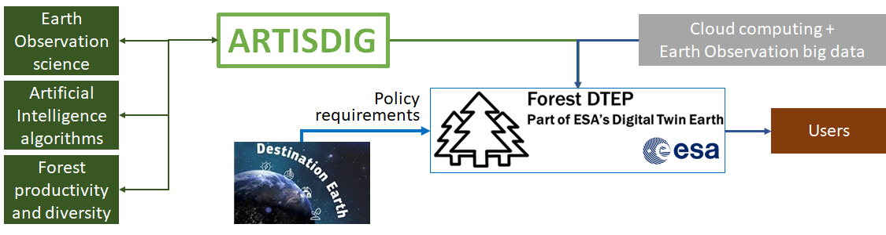

# ARTISDIG project

The project *Artificial Intelligence for Twinning the Diversity, Productivity and Spectral Signature of Forests* (ARTISDIG)
was funded by the [the Research Council of Finland](https://www.aka.fi/en) (previously known as Academy of Finland) for 2022-2024. The project consortium brings
together experts of digital twins and remote sensing (VTT), forest sciences and statistical analyses (Natural
Resource Institute Finland), and Artificial Intelligence (AI) and vegetation spectroscopy (Aalto University).
The principal investigators  in the consortium implementing the consortium are
* [Matti Mõttus](https://cris.vtt.fi/en/persons/matti-mottus), [VTT Technical Research Centre of Finland](https://www.vttresearch.com/en) (consortium PI)
* [Jorma Laaksonen](https://people.aalto.fi/jorma.laaksonen), [Aalto University](https://www.aalto.fi/en)
* [Mari Myllymäki](https://www.luke.fi/henkilosto/mari-myllymaki/), [Natural Resources Institute Finland (Luke)](https://www.luke.fi/en)
* [Miina Rautiainen](https://people.aalto.fi/miina.a.rautiainen), [Aalto University](https://www.aalto.fi/en)

# News
* AI work in ARTISDIG [highlighted by the Research Council of Finland](https://www.aka.fi/tietysti/teemat/tekoaly-teknologian-apuna/tekoalyn-ja-kaukokartoituksen-avulla-rakennetaan-metsan-digitaalista-kaksosta/) (in Finnish)

# Research goals in brief

The overall objective of ARTISDIG is to develop, implement and demonstrate the Earth 
observation and Earth system science required to integrate boreal forest biodiversity in the
Digital Twin Earth, which is being implemented via the
[Destination Earth (DestinE)](https://digital-strategy.ec.europa.eu/en/policies/destination-earth)
initiative as a part of the European Green Deal. As a part of DestinE,
[Forest Digital Twin Earth Precursor](https//foresttwin.org)
was implemented by VTT with funding from the [European Space Agency (ESA)](https://esa.int) in 2020–2021. The
digital twin enables monitoring and simulation of forests at global scale and at a very high
spatial resolution. At global scale, and considering the need to keep the twin up-to-date with the
actual state of the Earth’s forests, the inputs to the twin have to rely heavily on operationally
available Earth Observation (EO) data.

Forest digital twin will be an interactive high-fidelity replica of
Earth’s forests in the digital domain. To support actions on preserving forests as a
natural environment and not only as a pool of carbon,
a digital twin needs to account also for variation in biodiversity characteristics of forests.
The overall objective of ARTISDIG is to pioneer the science behind a digital twin of
the Earth’s forests, capturing their diversity, growth and productivity. This will enable to
integrate boreal forest biodiversity in the Digital Twin Earth.

  

ARTISDIG will develop novel methods to quantify and monitor forests’ structural and spectral variation by applying AI-based
algorithms to interpret EO data. We will combine physical and Aritifical Intelligence (AI) models, which has
recently gathered attention in the EO community, and which has been acknowledged to be a significant scientific challenge in the
forthcoming years. The new methods are designed to make full use of future satellite sensor systems, in anticipation of their increased
spectral and spatial resolutions. Results from ARTISDIG will enable to understand the effects of forest management policies in a
changing climate at a high spatial resolution relevant to forest stakeholders.

The ARTISDIG project is funded by the program *Key Areas of Green and Digital Transition* connected with  European Union’s
Recovery and Resilience Facility (RRF) and Finland’s Sustainable Growth Programme and targets the dual green and digital transition of the society.

# Work packages

## Work Package 1: Forest tree species and structural diversity
*Goal: To quantify the tree species and structural diversity of forests.*

PI: Mari Myllymäki (Natural Resources Institute Finland, Luke)

We will utilize different types of measures of forest diversity based on Airborne Laser Scanning (ALS) to quantify canopy structure and link it with forest (bio)diversity, quantified with its species diversity, variaton in tree size and spatial distribution. Field plot data will be used to determine site structural diversity, fertility and tree species richness. We will determine the spectrally separable classes in hyperspectral data and compare it against the simulated spectral diversity obtained in WP 2.

## Work Package 2. Forest spectral diversity
*Goal: To characterize the diversity of spectral signatures of boreal forests caused by 1) variation in forest structure, and 2) variation in spectral properties of forest elements.*

PI: Miina Rautiainen (Aalto University)

If the spectral properties of forest elements, forest structure and tree distribution pattern are known, the spectral signature of a forest can be simulated using a physically-based model with reasonable accuracy. The existing spectral libraries are based on limited samples for each of the represented species, leading to a large uncertainty in the estimate of the natural variation in spectral properties. We therefore will measure a more representative sample of the key overstory species relevant not only for forest carbon production, but also for boreal forest biodiversity (incl. aspen, ash, etc.) at peak growing season. Using the FRT forest reflectance model, we will the quantify the separability of the dfferent species and structurally different forests using classification tools typical of hyperspectral EO data, e.g. support vector machine and random forest. 

## Work Package 3. AI tools for mapping tree species and biodiversity
*Goal: To create an AI-based image analysis system, which can use future hyperspectral and high resolution optical imagery for assessing forest biomass, tree species and biodiversity.*

PI: Jorma Laaksonen (Aalto Unversity)

Modern AI-based methods work well for forest parameter retrieval in the boreal region and can utilize hyperspectral and very high resolution imagery. In contrast to traditional wellestablished global EO algorithms for vegetation biophysical properties, which rely on pixelbased retrieval, the novel and forthcoming AI tools are image-based, i.e., they make use of the structural information in the imagery. We will create an algorithm for estimating forest (bio)diversity using heterogeneous EO data inputs. The optimal input data, Very High Resolution (VHR) airborne hyperspectral imagery, will be used for developing the algorithms. As these data are not expected to be available for large geographic areas, the methods will be tested with combinations of hyperspectral 30 m imagery, multispectral 5 m imagery, and panchromatic “black-and-white” VHR (pixel <1 m imagery).

## Work Package 4. AI simulator for forest productivity and growth
*Goal: To develop an AI emulator of the models of forest structure, productivity, growth and reflectance for Digital Twin Earth. To use the emulator for modeling the effect of diversity on productivity.*

PI: Matti Mõttus (VTT)

The current implementation of Forest DTE Precursor contains the forest productivity model Preles (which computing gross primary production), coupled with a growth model CROBAS (which computes autotrophic respiration and litter production), called together PreBas. Soil processes are accounted for using the YASSO soil model. The key input variables for the models are basic forestry variables (incl. main tree species and site fertility), daily temperature, water vapor pressure deficit, photosynthetic photon flux density and precipitation (mm). The final goal of ARTISDIG is to integrate the results of the first three WPs into the digital twin infrastructure, allowing spatially explicit determination of forest diversity and its effect on forest functioning ond productivity. To improve processing speed, the existing modeling chain will be replaced with an AI-based emulator tool, allowing to implement the computations quickly for a large geographic area at high spatial resolution.

## Outcomes

The list will be updated stochastically during the course of the project

*Scientific journal papers*

* Rajala, T., Kangas, A. and Myllymäki, M. (2025) Computing Maps of Forest Structural Diversity: Aggregate Late. Preprint available at SSRN: https://ssrn.com/abstract=5119277 or http://dx.doi.org/10.2139/ssrn.5119277
* Kostensalo, J., Packalen, P., Kuronen, M. Mehtätalo, L., Tuominen, S. and Myllymäki, Mari (2025). Large-Scale Tree-Level Mapping of Forest Structure Including Species Type with Remote Sensing Data and Ground Measurements. Preprint available at SSRN: https://ssrn.com/abstract=5124085 or http://dx.doi.org/10.2139/ssrn.5124085

* Halme E. & Mõttus M. (2025). Hybrid regression method to predict forest variables from Earth observation data in boreal forests. European Journal of Remote Sensing, 58, 2462032, doi: [10.1080/22797254.2025.2462032](https://doi.org/10.1080/22797254.2025.2462032)
* Mercier, A., Karlqvist, S., Hovi, A. & Rautiainen, M. (2024) Hyperspectral data of understory elements in boreal forests: In situ and laboratory measurements. Data in Brief. 57, 111068. doi: [10.1016/j.dib.2024.111068](https://doi.org/10.1016/j.dib.2024.111068).
* Liu, W., Mõttus, M., Malenovský, Z., Shi, S., Alonso, L., Atherton J. & Porcar-Castell, A. (2025). An in situ approach for validation of canopy chlorophyll fluorescence radiative transfer models using the full emission spectrum. Remote Sensing of Environment, 316, doi: [10.1016/j.rse.2024.114490](https://doi.org/10.1016/j.rse.2024.114490).
* Mercier A., Myllymäki M., Hovi A., Schraik D., Rautiainen M. (2025). Exploring the potential of SAR and terrestrial and airborne LiDAR in predicting forest floor spectral properties in temperate and boreal forests. Remote Sensing of Environment 316, 114486, doi: [10.1016/j.rse.2024.114486](https://doi.org/10.1016/j.rse.2024.114486).
* Ihalainen, O., Sandmann, T., Rascher, U. & Mõttus, M. (2024). Spectral invariant-based illumination correction for shaded and sunlit surfaces for close-range hyperspectral images. Remote Sensing of Environment, 315, 114467, doi: [10.1016/j.rse.2024.114467](https://doi.org/10.1016/j.rse.2024.114467).
* Liu, W., Mõttus, M., Gastellu-Etchegorry, J.-P., Fang, H. & Atherton, J. (2024). Seasonal and vertical variation in canopy structure and leaf spectral properties determine the canopy reflectance of a rice field. Agricultural and Forest Meteorology, 355, 110132, doi: [10.1016/j.agrformet.2024.110132](https://doi.org/10.1016/j.agrformet.2024.110132).
* Kostensalo, J., Mehtätalo, L., Tuominen, S., Packalen, P. and Myllymäki, M. (2023). Recreating structurally realistic tree maps with airborne laser scanning and ground measurements. Remote Sensing of Environmen 298, 113782, doi: [10.1016/j.rse.2023.113782](https://doi.org/10.1016/j.rse.2023.113782).
* Myllymäki, M., Tuominen, S., Kuronen, M., Packalen, P. and Kangas, A. (2023). The relationship between forest structure and naturalness in the Finnish national forest inventory. Forestry: An International Journal of Forest Research, cpad053, doi: [10.1093/forestry/cpad053](https://doi.org/10.1093/forestry/cpad053).
* Halme, E. & Mõttus, M. (2023). Improved parametrisation of a physically-based forest reflectance model for retrieval of boreal forest structural properties. Silva Fennica, 57, 22028, doi: [10.14214/sf.22028](https://doi.org/10.14214/sf.22028).
* Gopalakrishnan, R., Korhonen, L., Mõttus, M., Rautiainen, M., Hovi, A., Mehtätalo, L., Maltamo, M., Peltola, H. & Packalen, P. (2023). Evaluation of a forest radiative transfer model using an extensive boreal forest inventory database. Science of Remote Sensing, 8, 100098, doi: [10.1016/j.srs.2023.100098](https://doi.org/10.1016/j.srs.2023.100098).

*Manuscripts to be submitted to scientific journals*
* Astola, H., Minunno, F., Kangas, A., Mõttus, M. (2025). Machine learning-based emulation of a forest growth and productivity model.
* Sirro, L., Rajala, T., Myllymäki, M., Halme, E., Mõttus, M. (2025). Spatial Distribution of Tree Crown Locations in a Boreal Forest and its Effect on Spectral Reflectance.

*Scientific conference papers*
* Chudasama, Y., Muhammad, U., Mäyrä, V., Guiotte, F. and Laaksonen, J. (2024). A Comparison of Hyperspectral Super-resolution Techniques for Boreal Forest Imagery. IEEE International Geoscience and Remote Sensing Symposium (IGARSS). [https://acris.aalto.fi/admin/files/162217710/A_Comparison_of_Hyperspectral_Super-Resolution_Techniques_for_Boreal_Forest_Imagery.pdf]
* Guiotte, F., Kostensalo, J. and Laaksonen, J. (2024). Mesh Surface and Morphological Hierarchy for Individual Tree Detection from LiDAR. IEEE International Geoscience and Remote Sensing Symposium (IGARSS). [https://acris.aalto.fi/admin/files/161252040/Mesh_Surface_And_Morphological_Hierarchies_For_Individual_Tree_Detection_And_Segmentation_From_LiDAR_Data.pdf]

*Data Sets*
* Kuusinen et al. (2022). Leaf spectra of four broadleaved deciduous tree species in Finland, doi: [https://doi.org/10.17632/3hswxj5nff.1](10.17632/3hswxj5nff.1).
* Mercier et al. (2023a). Leaf spectra of alder buckthorn, common hazel and European fly honeysuckle, doi: [10.17632/3bkrwhk4p3.1](https://doi.org/10.17632/3bkrwhk4p3.1)
* Juola et al. (2022) Stem reflectance spectra for standing dead Scots pine trees, doi: [10.17632/8dvx3vvvk9.1](https://doi.org/10.17632/8dvx3vvvk9.1).
* Mercier et al. (2023b) Reflectance spectra of boreal forest floor elements: ferns, herbaceous plants and decaying wood, doi: [10.17632/dddb2prk4p.1](https://doi.org/10.17632/dddb2prk4p.1)

*Conference presentations*
* Mercier A., Karlqvist S., Hovi A., Rautiainen M."Boreal forest diversity through in situ and laboratory spectral measurements of understory elements". 4th International symposium on applied geoinformatics, 9-10.05.2024, Wroclaw, Poland (poster)
* Mercier A., Myllymäki M., Hovi A., Schraik D., Rautiainen M. "From canopy structure to forest floor: the potential of LiDAR and SAR sensors for predicting boreal forest floor spectral properties", 6th Winter Satellite Workshop, 17-19.01.2024, Espoo, Finland (oral presentation)
* Mercier A., Myllymäki M., Hovi A., Schraik D., Rautiainen M. "Prédiction des propriétés spectrales du sol forestier à partir de capteurs LiDAR et RSO dans les forêts tempérées et boréales ", 9th Scientific Conference of the Hyperspectral Group of the French Society for Photogrammetry and Remote Sensing, 30-31.05.2024, Rennes, France (oral presentation)
* Mercier A., Myllymäki M., Hovi A., Schraik D., Rautiainen M. "Prediction of Forest Floor Spectral Properties from LiDAR and SAR Sensors in Temperate and Boreal Forests", EARSeL (European Association of Remote Sensing Laboratories), 17-20.062024, Manchester, United Kingdom (oral presentation)
* Mõttus, M., Halme, E., Ihalainen, O. "Use of spectral invariants for broadleaf tree species mapping in a boreal forest", 14th Workshop on Hyperspectral Image and Signal Processing: Evolution in REmote Sensing (WHISPERS), 9.11.12.2024 Helsinki, Finland.
* Mõttus M. et al. "Digital Twin of the Earth’s forests: part of the Destination Earth initiative", Third Destination Earth User eXchange, Darmstadt, Germany 15.-16.10.2024 (poster).
* Mõttus M. & Ovaskainen, O. "DestinE Data Lake Biodiversity Use Case", Third Destination Earth User eXchange, Darmstadt, Germany 15.-16.10.2024 (oral).
* Halme, E., Ihalainen, O., Mõttus, M. "Identification of a Biodiversity Indicator Species in the Hyperspectral Signature of Boreal Forests", 13th EARSeL Imaging Spectrocopy Special Interest Group Workshop, Valencia, Spain 16.-19.4.2024 (oral)
* Kostensalo, J., Mehtätalo, L., Tuominen, S., Packalen, P., Myllymäki, M. ”Recreating structurally realistic tree maps with airborne laser scanning and ground measurements” , IUFRO World Congress 2024, 24.-29.6.2024, Stockholm, Sweden (oral by poster)
* Mõttus, M., Astola, H., Halme, E., Minunno, F. "Machine learning of process-based models for DestinE forest digital twin",	IUFRO World Congress 2024, 24.-29.6.2024, Stockholm, Sweden (oral by poster)
* Kostensalo, J. et al. "Recreating structurally representative tree maps with remote sensing and ground measurements",  13th Workshop on Spatial Statistics and Image Analysis in Biology (SSIAB), 16.-19.5.2022 (talk 25 min)
* -"- ForestSAT, Berlin/online 29.8.-3.9.2022 (poster)
* -"- INFOBIOM (The Nordic Network for Integrated Forest Resource and Biodiversity Monitoring) Oslo, Norway 24.-25.11.2023 (talk 15 min) 
* -"- IBFRA Conference Helsinki 28.-31.8.2023 (talk 15 min)
* Mari Myllymäki "Forest structure and naturalness in the Finnish national forest inventory",  INFOBIOM (The Nordic Network for Integrated Forest Resource and Biodiversity Monitoring) Oslo, Norway 24.-25.11.2023 (talk)
* Mari Myllymäki "Creating countrywide tree maps with ITD and bootstrapping", The 14th Workshop on Spatial Statistics and Image Analysis in Biology (SSIAB), 23.-25.5.2023, Grenoble, France (poster)
* Mari Myllymäki "Structure of natural and non natural forests in the Finnish national forest inventory (NFI) data", IBFRA Conference Helsinki 28.-31.8.2023 (talk)
* Halme, E. et al. "Retrieving boreal forest structure from remote sensing data with a reflectance model and machine learning methods". IBFRA Conference Helsinki 28.-31.8.2023 (poster)
* Halme, E. & Mõttus, M. "Improvements in forest reflectance modelling enabled by new hyperspectral in situ measurements", ForestSAT 2022, Berlin 29.8.-3.9 (oral presentation)
* M. Mõttus et al. "Towards a Digital Twin of the Earth's Forests", ForestSAT 2022, Berlin 29.8.-3.9 (oral)
* M. Mõttus et al. "Towards a Digital Twin of the Earth's Forests", Living Planet Symposium 2022, Bonn 23.5-27.5 (oral presentation, presented by T. Häme)
* Yuvrajsinh Chudasama, Ville Mäyrä, Usman Muhammad, Florent Guiotte, Jorma Laaksonen. "Hyperspectral Super-resolution with Deep Learning for Forestry Applications", 6th Winter Satellite Workshop, 17-19.01.2024, Espoo, Finland (oral presentation)
* Florent Guiotte "Predicting tree species in the wild - Caractérisation des arbres par données LiDAR et hyperspectrales de la forêt boréale", Colloque scientifique du Groupe Hyperspectral de la Société Française de Photogrammétrie et de Télédétection, 30.5.2024, Rennes, France (oral presentation)
* Yuvrajsinh Chudasama "A Comparison of Hyperspectral Super-resolution Techniques for Boreal Forest Imagery", IEEE International Geoscience and Remote Sensing Symposium (IGARSS), 7-12.7.2024, Athens, Greece (oral presentation)
* Florent Guiotte "Mesh Surface and Morphological Hierarchy for Individual Tree Detection from LiDAR", IEEE International Geoscience and Remote Sensing Symposium (IGARSS), 7-12.7.2024, Athens, Greece (oral presentation)
* Ville Mäyrä "Forest variable predictions with hyperspectral inputs", AI Day 2024 + Nordic AI Meet, 21-22.10.2024, Helsinki, Finland (poster presentation)

*Visibility*
* [Web article by Research Council of Finland](https://www.aka.fi/tietysti/teemat/tekoaly-teknologian-apuna/tekoalyn-ja-kaukokartoituksen-avulla-rakennetaan-metsan-digitaalista-kaksosta/) [in Finnish]

This project has received funding from the European Union – NextGenerationEU instrument via the Research Council of Finland under grant number 348035
