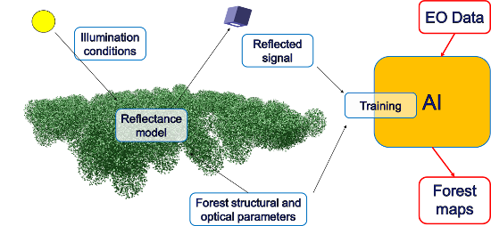

# Sensillence

is the combination Remote Sensing and Artificial Intelligence by [VTT physical remote sensing researchers](./VTT) and Aalto University Department of Computer science.

  

This is implemented in the [AIROBEST](https://sensillence.github.io/AIROBEST) project funded by the [Academy of Finland](https://www.aka.fi).

The people involved in Sensillence community are listed under the groups and teams participating the project. As the page is being updated, the list is not complete yet.

News:

* [VTT creating digital forest twin for European Space Agency](https://www.goodnewsfinland.com/vtt-creating-digital-forest-twin-for-european-space-agency/)
